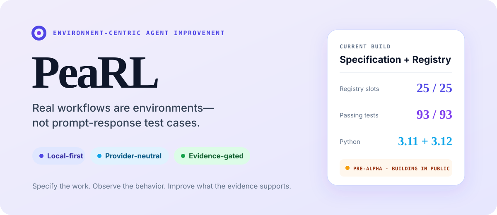
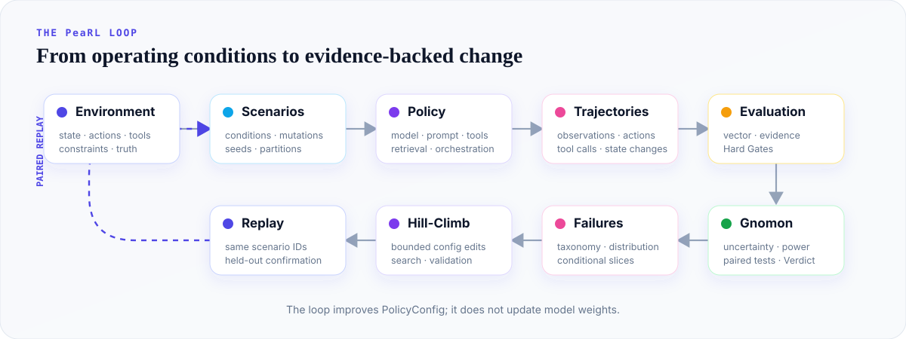
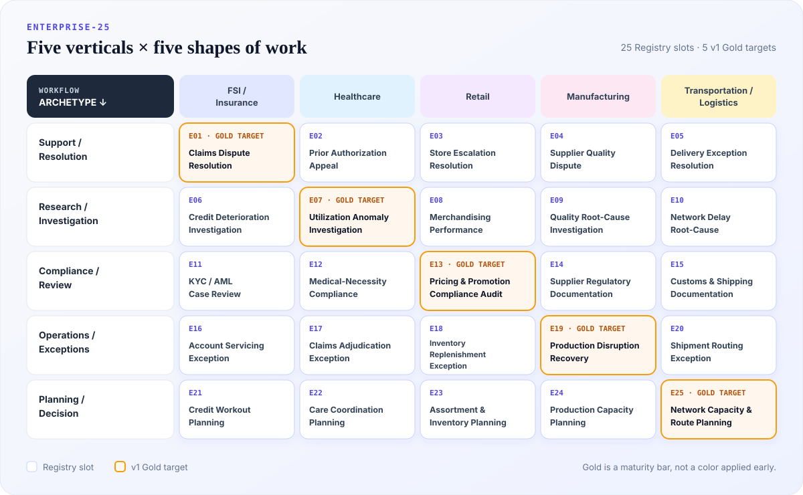

<p align="center">
  
</p>

<p align="center">
  <a href="#01--the-gap-between-a-prototype-and-production">Why environments</a>
  ·
  <a href="#02--how-pearl-works">How it works</a>
  ·
  <a href="#03--run-whats-available-now">Quickstart</a>
  ·
  <a href="#06--enterprise-25">Enterprise-25</a>
  ·
  <a href="ARCHITECTURE.md">Architecture</a>
</p>

<p align="center">
  <a href="https://github.com/subramanyanashwath/PeaRL/actions/workflows/ci.yml"></a>
  <a href="LICENSE"></a>
</p>

**Real workflows are environments—not prompt-response test cases.**

PeaRL turns messy agentic workflows into environments where behavior can be
measured, failures can be localized, changes can be tested, and improvements
can be trusted.

It is local-first and provider-neutral. PeaRL improves the system around the
model—prompts, tools, retrieval, context, orchestration, and escalation
rules—without training model weights.

> **Current build: reproducible Runs.** Declarative environments, deterministic
> Scenario distributions, executable runtime and Policy contracts, immutable
> Trajectories, and atomic JSONL Run bundles are available now. See the
> [journal](docs/JOURNAL.md) for the unvarnished version.

## 01 / The gap between a prototype and production

A prototype asks: **does this answer look good?**

Production asks a harder question: **does this agent behave correctly across
the distribution of states it will actually encounter?**

That sounds like a small distinction. It is not. Real workflows contain stale
records, conflicting evidence, partial permissions, tool outages, human
handoffs, changing state, and asymmetric costs when the agent gets something
wrong. An agent can look good on average and still fail reliably in the cases
that matter.

| A typical eval starts with... | PeaRL starts with... |
| --- | --- |
| A fixed prompt set | A scenario distribution |
| An input and final answer | State, observations, actions, tools, and transitions |
| One aggregate score | An Evaluation Vector and Hard Gates |
| A list of failures | A conditional Failure Distribution |
| The best result seen during iteration | A candidate confirmed on held-out scenarios |

PeaRL treats the surrounding workflow as the unit of experimentation.

## 02 / How PeaRL works

<p align="center">
  
</p>

This is the locked v1 loop. The
[build-status section](#10--build-status) separates what runs today from what
ships in the next milestones.

1. Define the workflow as an `EnvironmentSpec`.
2. Sample reproducible `Scenarios` from the conditions the agent may face.
3. Run a `Policy` and capture its complete, immutable `Trajectories`.
4. Evaluate behavior across decomposed dimensions—not only one scalar score.
5. Use **Gnomon** to quantify uncertainty and decide what the evidence supports.
6. Find the conditions where failures concentrate.
7. Propose a bounded `PolicyConfig` change, replay, and confirm it on held-out
   scenarios.

The output is not just “P1 scored higher than P0.” It is a traceable account of
**what changed, where behavior improved, what regressed, and whether the result
is strong enough to act on.**

## 03 / Run what is available now

```bash
git clone https://github.com/subramanyanashwath/PeaRL.git
cd PeaRL
python -m pip install -e ".[dev]"
pearl registry list
pearl validate path/to/environment.yaml
pearl sample E01 --n 50 --seed 42
pearl run E01 --policy baseline --partition search
pytest -q
ruff check .
mypy src
```

Validate any PeaRL environment specification:

```bash
pearl validate path/to/environment.yaml
```

The current build includes strict Pydantic models, the complete Enterprise-25
Registry, deterministic Scenario distributions, executable E01 Episodes,
content-addressed Run manifests, inspectable Scenario and Trajectory JSONL,
bootstrap confidence intervals, and design-aware power utilities. It runs on
Python 3.11 and 3.12. Run artifacts are written under `runs/<run_id>/` by
default and are ignored by Git.

## 04 / Start with the work

Before a workflow can become an environment, its operating contract has to be
made explicit. PeaRL uses **Objective + ACTRW** as the discovery structure.

| Field | The question it forces |
| --- | --- |
| **Objective** | What business outcome should this workflow produce? |
| **Agency** | What should the agent own, and what remains human-owned? |
| **Context** | What information changes the correct behavior? |
| **Truth** | Which sources are authoritative, and what happens when they disagree? |
| **Risk** | What happens if the agent is wrong? |
| **Workflow** | What are the actors, states, actions, handoffs, exceptions, and completion conditions? |

Objective is established first; ACTRW follows. Together they provide structured
provenance for an `EnvironmentSpec`. They are not the executable environment
itself.

That distinction matters. A good discovery conversation can reveal the work;
only a runtime can expose how an agent behaves inside it.

## 05 / The flagship experiment

> **E01 · Claims Dispute Resolution** is the v1 flagship target. It is not a
> published empirical result yet. When the executable experiment ships, this
> section will contain the real report and reproduction command—not showroom
> numbers.

E01 models an insurance-claim dispute across conditions such as:

- complete, missing, stale, or conflicting evidence;
- unavailable tools and partial tool results;
- ambiguous policy language;
- cases that require escalation or human approval;
- requests that exceed the agent's authority.

The experiment will run an incumbent Policy, expose its conditional Failure
Distribution, change one bounded part of its `PolicyConfig`, replay the same
scenario IDs, and use unseen confirmation scenarios for the final Gnomon
Verdict.

Why condition the failures? Because these are different claims:

```text
P(wrong_tool)

P(wrong_tool | conflicting_truth)
```

The first is an average. The second tells you whether a specific production
condition breaks the agent. That is usually the more useful fact.

A diagnosed failure can then become a reusable scenario family: evidence from
one engagement becomes a sharper test for the next one.

## 06 / Enterprise-25

Five verticals. Five workflow archetypes. Twenty-five environment slots.

The point is not to collect examples. The point is to test whether the same
abstractions survive different industries **and** different shapes of work.

<p align="center">
  
</p>

The v1 Gold diagonal deliberately spans every vertical and every workflow
archetype:

| Gold | Environment | Vertical | Workflow |
| ---: | --- | --- | --- |
| G1 | **E01 Claims Dispute Resolution** | FSI / Insurance | Support / Resolution |
| G2 | **E07 Utilization Anomaly Investigation** | Healthcare | Research / Investigation |
| G3 | **E13 Pricing & Promotion Compliance Audit** | Retail | Compliance / Review |
| G4 | **E19 Production Disruption Recovery** | Manufacturing | Operations / Exceptions |
| G5 | **E25 Network Capacity & Route Planning** | Transportation / Logistics | Planning / Decision |

`Registry` means the environment has a named slot and explicit objective.
`Bronze` means its specification, state model, evaluator plan, and trusted Seed
Scenarios are complete. `Gold` means it is executable, reproducible, tested, and
ships with a baseline, improved candidate, Failure Distribution, paired replay,
and Gnomon comparison.

Gold should mean something. PeaRL v1 targets five deep environments and twenty
schema-complete ones—not twenty-five shallow demos held together by twenty-five
special cases.

Browse the canonical
[Enterprise-25 Registry](environments/enterprise25/registry.yaml).

## 07 / Gnomon: evidence before confidence

Aggregate scores move for plenty of bad reasons: noise, scenario composition,
evaluator variance, or plain experimental leakage. **Gnomon is PeaRL's
statistical inference layer.** It asks whether an apparent improvement is real
enough to support a decision.

Gnomon currently contributes bootstrap uncertainty and design-aware power
utilities. PeaRL v1 extends it with paired comparisons, judge calibration,
regression checks, and non-compensatory Hard Gates. It does not generate
scenarios, execute environments, evaluate trajectories, or optimize policies.

| Verdict | Meaning |
| --- | --- |
| `SHIP` | Evidence supports the candidate and every Hard Gate passes. |
| `ITERATE` | The candidate is not ready, but further search remains reasonable. |
| `BLOCK` | A Hard Gate failed or a material regression makes adoption unacceptable. |
| `UNDERPOWERED` | The experiment cannot detect the effect it claims to care about. |
| `INVALID` | Broken data, evaluators, scenarios, or experimental design prevent inference. |

“Inconclusive” is not a universal shrug. PeaRL records the actual reason.

## 08 / Improvement without pretending it is weight training

PeaRL is RL-forward about its primitives and conservative about its claims.

The environment, Policy, Trajectory, and feedback loop are first-class. The v1
optimizer is deliberately simple: bounded local hill-climbing over
`PolicyConfig`, including prompts, tool descriptions, retrieval settings,
context formatting, orchestration rules, evidence thresholds, and escalation
behavior.

It does **not** perform PPO, GRPO, RLHF, policy gradients, or model-weight
training.

```text
baseline
   ↓
SEARCH: propose and evaluate bounded neighbors
   ↓
VALIDATION: select the promising candidate
   ↓
CONFIRMATION: replay on unseen scenarios
   ↓
GNOMON: SHIP / ITERATE / BLOCK / UNDERPOWERED / INVALID
```

PeaRL is opinionated here: search evidence is optimization evidence. It is not
held-out confirmation evidence just because the number looks nice.

## 09 / Bring the agent you already have

PeaRL is designed to sit between workflow definition and the existing agent
stack. It is not another prompt manager, observability product, hosted agent
runtime, or replacement for an evaluation harness you already trust.

The `Policy` boundary represents the complete agent system: model,
instructions, tools, retrieval, context assembly, orchestration, and escalation
logic. The v1 architecture is designed so an existing agent can sit behind a
Policy adapter while PeaRL owns the environment, experiment, and evidence
contracts. The legacy Gnomon Agent adapter is available; provider-specific
adapters remain later work. The public interfaces remain provider-neutral.

| Concept | Boundary |
| --- | --- |
| `EnvironmentSpec` | Declarative, serializable operating contract |
| `EnvironmentRuntime` | Executable state transitions |
| `Scenario` | One instantiated situation from an Environment |
| `Policy` | The complete agent system being evaluated |
| `PolicyConfig` | The tunable state of that system |
| `Trajectory` | Immutable execution evidence from one Episode |
| `Evaluation Vector` | Decomposed measurements plus Hard Gates |
| `Gnomon` | Statistical inference and experiment Verdicts |

## 10 / Build status

Progress means shipped artifacts, not plans.

| State | What it contains |
| --- | --- |
| **Available** | Gnomon bootstrap and power kernel; declarative specifications; YAML validation; Enterprise-25 Registry; deterministic Scenario distributions; `EnvironmentRuntime`; async Policy adapters; immutable Trajectories and Steps; `RunManifest`; atomic JSONL artifacts; reusable Episode and batch runners; deterministic E01 baseline; CLI; 147 passing tests |
| **Building next** | Evaluation Vectors and deterministic evaluators, attached as records separate from immutable Trajectories |
| **v1 release target** | Multi-step trajectories, Evaluation Vectors, conditional Failure Distributions, Gnomon Verdicts, bounded hill-climbing, five Gold environments, twenty Bronze environments, and a reproducible E01 report |

The detailed implementation sequence lives in the
[canonical PRD](docs/PRD.md). The [journal](docs/JOURNAL.md) records what
actually shipped, how it was verified, and what remains unresolved.

## 11 / Honest boundaries

PeaRL v1 is not:

- model-weight training or a general RL framework;
- hosted SaaS, a cloud control plane, or a multi-tenant platform;
- production telemetry or an observability replacement;
- a benchmark marketplace or giant provider-adapter ecosystem;
- Microsoft-specific code or a wrapper around private customer workflows.

The examples are synthetic, the public core is generic, and the APIs are
pre-alpha. Limitations belong in every experimental report; if a result is
underpowered or invalid, the software should say so plainly.

## 12 / Project map

- [Product boundary](SCOPE.md)
- [Architecture](ARCHITECTURE.md)
- [Canonical PRD](docs/PRD.md)
- [Engineering journal](docs/JOURNAL.md)
- [Enterprise-25 Registry](environments/enterprise25/registry.yaml)
- [Backlog](BACKLOG.md)
- [Gnomon provenance](NOTICE)

PeaRL works independently. **FieldOS** is planned as a separate field-learning
harness that can translate structured engagements into draft PeaRL environment
specifications; PeaRL does not depend on it.

## License

[MIT](LICENSE). The Gnomon statistical modules retain attribution to their
original project and license; see [NOTICE](NOTICE).

Built by [Ashwath Subramanyan](https://github.com/subramanyanashwath).
